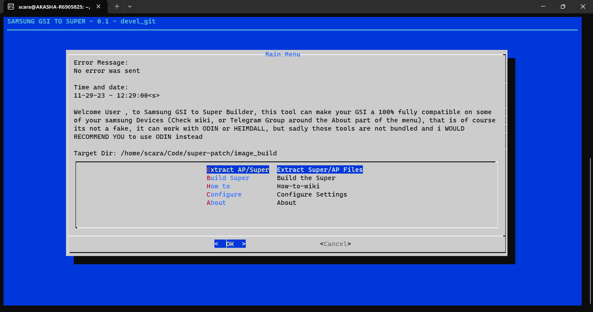
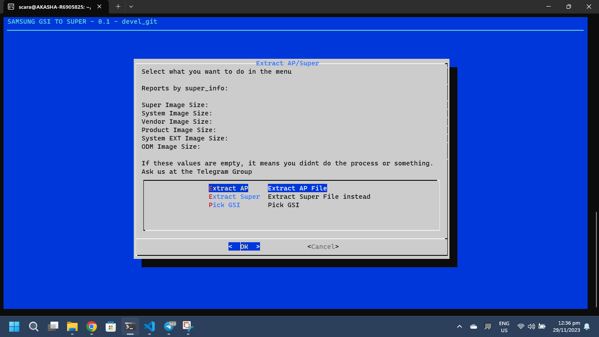
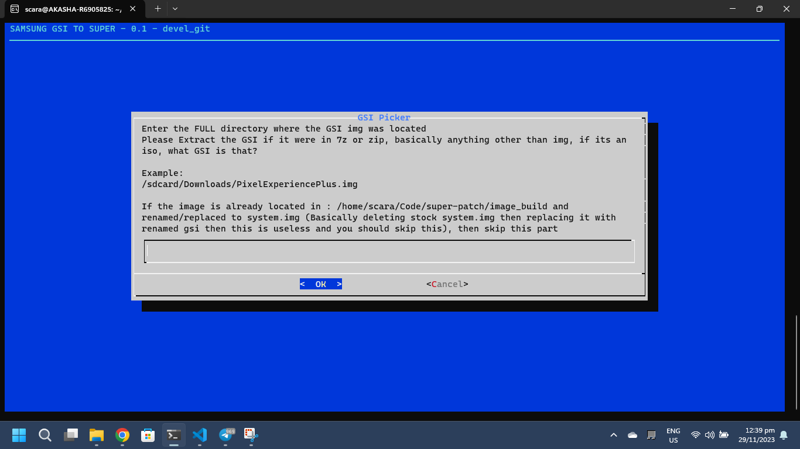
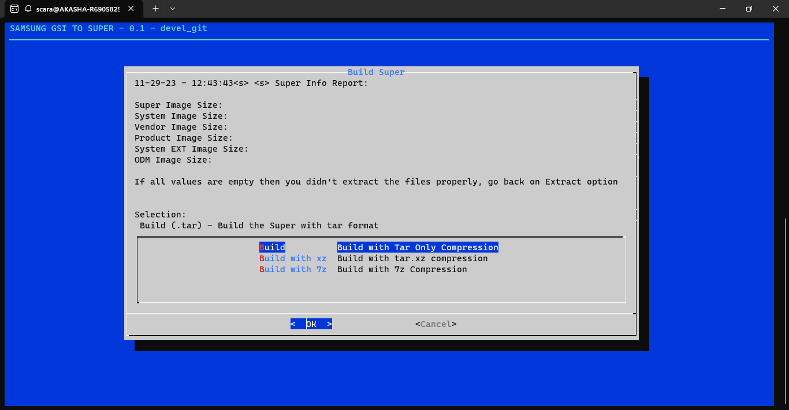

# SAMSUNG GSI TO SUPER BUILDER

This is still in development

---

Badges:


 


---

This Script Only works on termux for now


## Credits due who supported the project:

- [Takumi123x](https://github.com/Takumi123x) - which some parts of this code are based of [rou](https://github.com/Takumi123x/rou), this repository, `super-patch` is just a UI reskin using [dialog](https://invisible-island.net/dialog/) as a backend with some added features in
- [Exynos 850 Group in Telegram](https://t.me/a12schat)
- KiriTheThird on Telegram

---

## Introduction

What is super-patch?

Super-patch is a Samsung GSI to Super Builder, as partition tables are getting more complex, this script can help you make sure any GSI with any A/B Partition modes will work! **BUT IT DOES NOT GUARANTEE THAT IT WILL REALLY WORK BECAUSE GSIs TEND TO NOT WORK IN SOME DEVICES REGARDLESS OF USING THIS TOOL**

## Table Chart!

| THINGS                    | ROU | SUPER-PATCH |
|---------------------------|-----|:-----------:|
| TD-based GSI BUILDING     | [x] |     [x]     |
| NON-TD Based GSI BUILDING | [x] |     [x]     |
| RENAME OUTPUT BUILDS      | [ ] |     [x]     |
| CHANGE DIRECTORY BUILD    | [x] |     [x]     |
| BUILT-IN WIKI             | [ ] |     [x]     |
| AP Extract                | [x] |     [x]     |
| GSI PICKER                | [ ] |     [x]     |
| GSI FILE DOWNLOAD         | [ ] |     [ ]     |
| Multi Language            | [ ] |     [ ]     |

Rou is very simple and sticks to its core purpose while super-patch make sure that the building process are mostly happen in Termux, with little intervention on the outside (soon)

# Instructions

Well you want to build a Super for your Samsung Device, well this script got you!

*This instruction works only on termux*

First copy these:

```
cd ~ && apt update && apt upgrade && apt update && apt install git curl dialog -y && git clone https://github.com/SUFandom/super-patch
```


After that, run this:

```
cd super-patch && chmod +x *.sh && ./builder.sh
```

There will be a disclaimer which you can press enter, then the main menu shows up, you have options




The target dir mentions where the building takes place, the screenshot sample just shows the WSL directory, for android it would be `/data/data/com.termux/files/home/storage/image_build` which basically means your `/storage/emulated/0/image_build`

Put your AP image file (we recommend you use magisked AP using Magisk Delta, get that on Exynos 850 Telegram group) to the target dir mentioned

After that you will see this after entering the highlighted Extract AP/Super



Select Extract AP

Then it should extract 

After that you should go back to the menu, select Extract Super then it should extract Super.img

After that this comes up:



Altho it is preferrable to do manually on this part as this is not fixed yet, go to Zarchiver, then the image_build directory, delete product.img and system.img. After that Extract the GSI Image and rename it to system.img then put it to the image_build folder 

After that:



Go back to main menu and then select Build Super > Build 

Wait paitiently until it asks the name


You can go enter then it will save by default but if you want to rename the output file, make sure it doesn't has spaces on it or the script will break

After that, its done, you can find it in the image_build with the tar file ready to be flashed using ODIN

If you have questions, go to Telegram group 

---

## System Requirements 

Windows:
- WSL 2 With Hyper-V support and 8GB of RAM 

Android:
- Termux 0.118 with ARM64 Device, 4GB of RAM and 128GB of Storage 

Debian:
- Coming Soon... 

